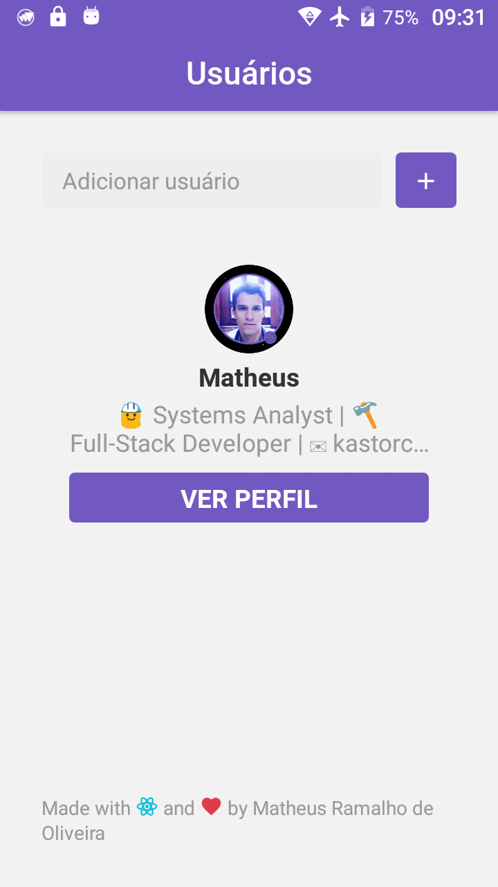
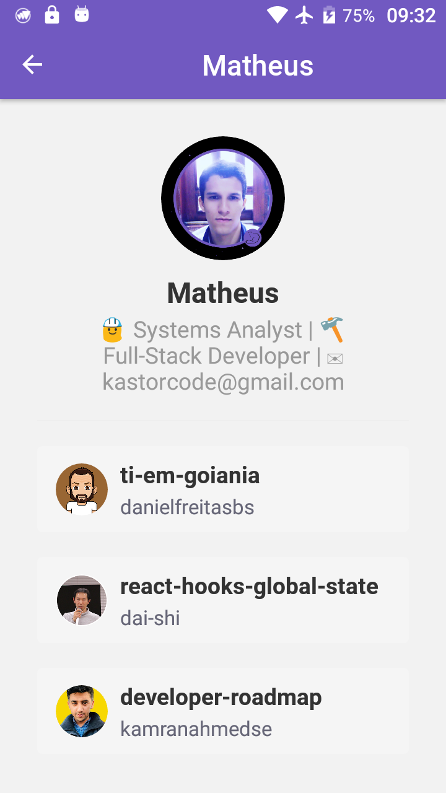
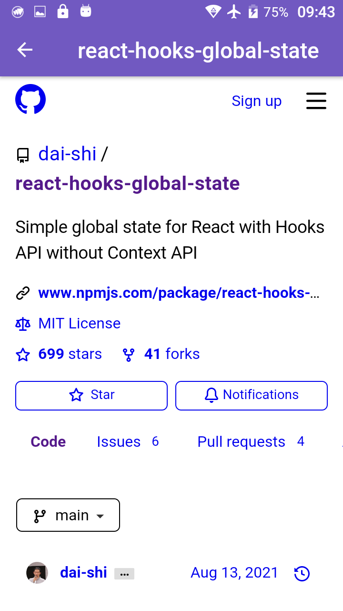
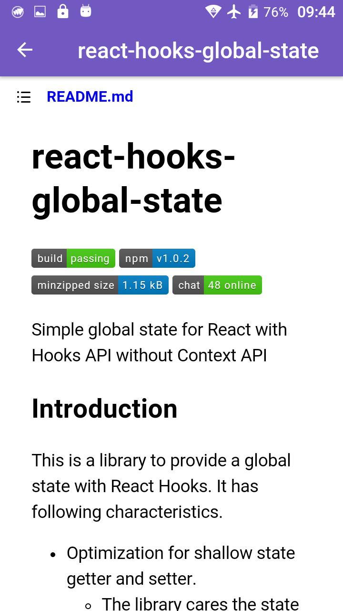
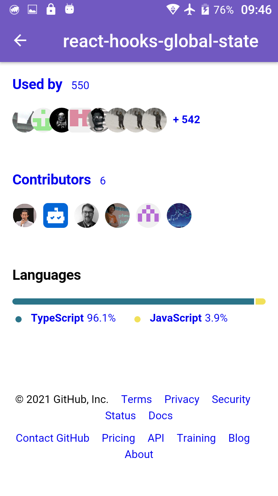
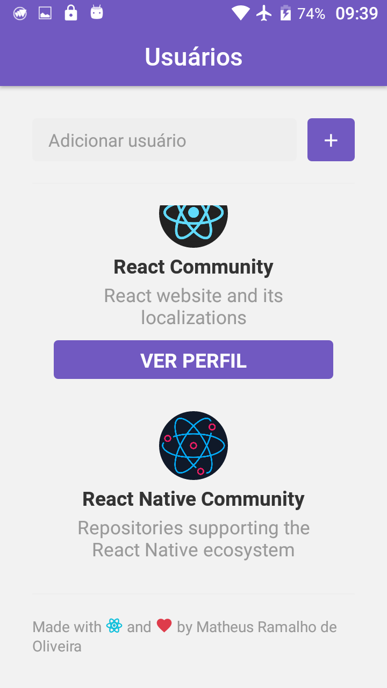

## GoStack Bootcamp Challenge 6
> 🚀 Practical project of the [Rocketseat](https://rocketseat.com.br) GoStack Bootcamp.  
👷 Developed by Matheus Ramalho de Oliveira.  
🔨 Systems Analyst, Full-Stack Developer.  
🏡 Goiânia, Goiás, Brasil.  
✉️ kastorcode@gmail.com  
👍 [instagram.com/kastorcode](https://www.instagram.com/kastorcode)

---

### Screenshots

<p align="center">
  
</p>
<p align="center">
  
</p>
<p align="center">
  
</p>
<p align="center">
  
</p>
<p align="center">
  
</p>
<p align="center">
  
</p>

---

<p align="center">
  
</p>
<p align="center">
    Challenge 6: First project with React Native
</p>

---

## :rocket: Sobre o desafio

Nesse desafio você adicionará novas funcionalidades na aplicação que desenvolvemos ao longo desse módulo.

### Funcionalidades

#### 1. Loading de repositórios

Adicione um indicator de loading utilizando `<ActivityIndicator />` antes de carregar a lista de repositórios favoritados na tela de detalhes do Usuário.

#### 2. Scroll infinito

Adicione uma funcionalidade de scroll infinito na lista de repositórios favoritados. Assim que o usuário chegar nos **20%** do final de lista, busque pelos items na próxima página e adicione na lista. Seu código ficará da seguinte forma:

```js
<Stars
  onEndReachedThreshold={0.2} // Carrega mais itens quando chegar em 20% do fim
  onEndReached={this.loadMore} // Função que carrega mais itens
  // Restante das props
>
```

Para requisitar uma nova página no Github utilize um parâmetro `page` no fim da URL:

```
https://api.github.com/users/diego3g/starred?page=2
```

#### 3. Pull to Refresh

Adicione uma funcionalidade para quando o usuário arrastar a listagem de repositórios favoritados pra baixo atualize a lista resetando o estado, ou seja, volte o estado da paginação para a página 1 exibindo apenas os 30 primeiros itens.

A funcionalidade "Pull to Refresh" existe por padrão na FlatList e pode ser implementada através do seguinte código:

```js
<Stars
  onRefresh={this.refreshList} // Função dispara quando o usuário arrasta a lista pra baixo
  refreshing={this.state.refreshing} // Variável que armazena um estado true/false que representa se a lista está atualizando
  // Restante das props
>
```

#### 4. WebView

Crie uma nova página na aplicação que vai ser acessada quando o usuário clicar em um repositório favoritado, essa página deve conter apenas o Header da aplicação. O conteúdo da página será uma WebView, ou seja, um browser integrado que exibe o atributo `html_url` presente no objeto do repositório que vem da API do Github.

Documentação de utilização da [WebView](https://github.com/react-native-community/react-native-webview/blob/master/docs/Getting-Started.md).

Exemplo de código:

```js
<WebView source={{ uri: repository.html_url }} style={{ flex: 1 }} />
```

Resultado:


---

### 🗓 ️Roadmap
- Introduction to Node.js
- Creating Node.js project
- Continuing Node.js project
- CSS Flexbox
- UI Design
- Introduction to React
- First project with ReactJS
- First project with React Native
- Front-end documentation
- Flux architecture
- Using React Hooks
- Server-side rendering(SSR) with ReactJS
- GraphQL
- Expo
- Creating ReactJS project
- Creating React Native project
- Animations with React Native
- Full-stack app development
- Node.js tests
- Node.js deploy
- ReactJS tests
- React Native tests
- ReactJS deploy
- React Native publication
- WebSocket with Express
- Advanced patterns at Node.js
- OmniStack SaaS(software as a service) and AdonisJS
- Final challenge
- Monorepo
